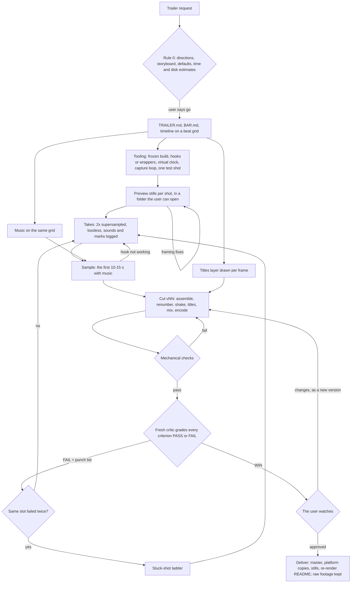

# launch-trailer-skill (`launch-trailer`)

An agent skill for making launch trailers, teasers, promos and other short movies from your own game or app. A lead agent agrees a hook-first brief and storyboard with you, films every shot from the real running build with time under its control, cuts the takes to music on a beat grid with titles and an end card, and loops preview stills, a sample cut, mechanical checks and a **fresh critic** until the cut passes a PASS/FAIL bar and you approve it.

The skill is **instructions only**. It bundles no code and assumes no particular agent: each agent uses the tools its environment provides (a shell, ffmpeg, browser automation such as Playwright, subagents if it has them) and writes the small tools a trailer needs inside your project. Tested recipes for the hard parts (a stepped clock for browser builds, the capture loop, every ffmpeg command) are in `references/recipes/`.

It comes from two real trailer runs, written up in `references/case-studies.md`: the 60-second [BlockHaven](https://blockhaven-blue.vercel.app) launch trailer, which built the method, and a 58-second trailer for a browser flight game, which reused it.

## Install

Copy the `launch-trailer/` folder into wherever your agent loads skills from. It needs a shell and ffmpeg; browser builds also need browser automation such as Playwright with Chromium.

## How it works



| Phase | Output | Gate |
| :--- | :--- | :--- |
| Brief | `TRAILER.md`: length, shapes, must-show list, hook, storyboard, end card, music, decisions | the user says go |
| Timeline | slots on a beat grid, the shot list, the hits | the slots add up |
| Tooling and preview | hooks, clock, capture loop; three stills per shot | the user has seen the stills |
| Takes, music, titles | lossless takes, the score, the titles layer | every slot has a take |
| Sample and cuts | the first 10-15 s, then numbered full cuts | checks pass, critic WIN, the user approves |

What it guards against:

1. **Slow openings**: frame 1 moves and impresses, the title lands by about 3 seconds, interface shots are flashes followed by their payoff.
2. **Fake footage**: every frame comes from the real build; only declared graphic slots, such as the end card, are drawn.
3. **Uneven motion and drift**: a virtual clock steps exactly one frame at a time; cuts, titles and music share one beat grid; frames are renumbered before titles go on top, and a frame-counter probe proves it.
4. **Self-grading**: whoever made the cut never grades it. A fresh critic grades a versioned bar from contact sheets, full-size frames and a mechanical report, or the user grades when no critic can view images.
5. **Surprises**: time and disk estimates up front, a preview folder in the first hour, a sample before the full render, and honest status when a change adds time.
6. **Lost work**: every cut gets a new version number, and raw footage, earlier cuts and previews stay until the user says they are happy.
7. **Rights and privacy**: music, sounds and fonts are original or licensed and recorded; no personal data, real accounts, other brands, version numbers or dates on screen.

## Layout

```text
launch-trailer-skill/
  README.md                   this file
  LICENSE                     MIT license for the repo
  launch-trailer/             the skill
    SKILL.md                  the pipeline, Rule 0, story rules, capture, edit, audio, delivery, review, non-negotiables
    LICENSE                   MIT license, shipped with the skill
    references/
      project-files.md        layout, TRAILER.md, shot list, timeline file, takes manifest, CUTS.md, re-render README
      brief-and-story.md      questions, formats and lengths, story shapes, hooks, the beat grid, pacing
      capture.md              capture routes, frozen builds, reaching the product, deterministic time, staging, camera, pixel art
      edit-and-titles.md      assembly, the titles layer, readability, transitions, colour, the end card, vertical layouts
      audio.md                music rights, music on the grid, licensed tracks, the product's own sounds, mixing, loudness
      delivery.md             the master spec, platform copies, naming and versions, storage, budgets, the handover report
      review.md               the trailer bar, mechanical checks, the watch-through, user review, stuck shots, final checklist
      critic-prompt.md        drop-in critic prompt, verdict formats, the verdict check, grading by the user
      pitfalls.md             symptoms, causes and fixes from real runs
      case-studies.md         the BlockHaven and Lightning Sortie trailers as worked examples
      recipes/
        virtual-clock.md      a stepped clock for browser builds, with its tests
        capture-harness.md    browser capture into lossless takes, camera helpers, a shot script, the sound log, a runner
        ffmpeg.md             assembly, shake, the master, platform copies, sheets, checks, the effects stem, the audio mix
```

## License

MIT. See [LICENSE](LICENSE).
